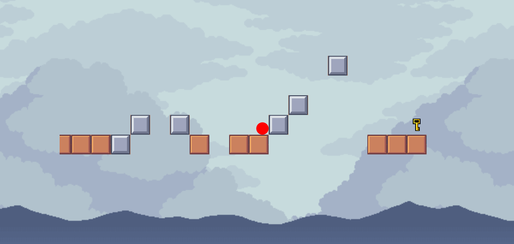

# Keyrunner




This is a simple platformer game I made trying out the Flame engine.

The game is deployed [here](https://keyrunner-h32y2y3.web.app/)

## To run locally

Clone the repository and in the root directory run:

```
flutter run
```

## Instructions

The goal of the game is to complete levels by passing obstacles and collecting keys.

Movement in the game is simple, the ball jumps with a left-click or a tap.

## Assets used

Kenney Pixel Platformer Tiles

[Kenney](www.kenney.nl)

Rengo Cloud Sky Parallax

[Rengo](https://rengodev.itch.io/free-cloud-sky-parallax-background)
